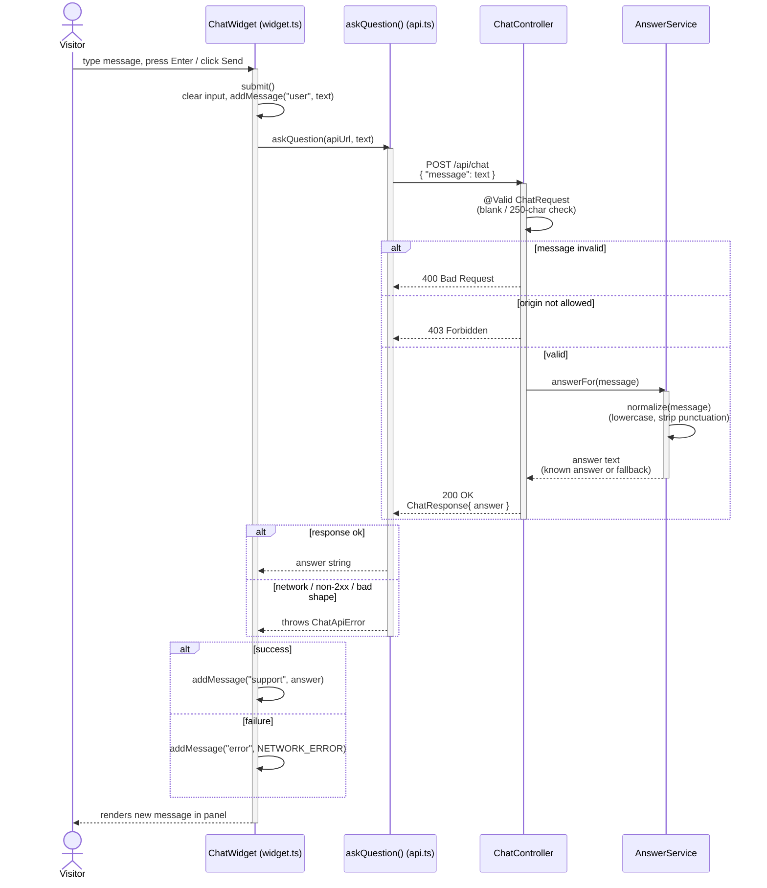

# Request sequence

How a chat message travels from the widget to the backend and back, across `ChatWidget` (widget repo), `ChatController`, and `AnswerService` (this repo).

```mermaid
sequenceDiagram
    actor Visitor
    participant ChatWidget as ChatWidget (widget.ts)
    participant api as askQuestion() (api.ts)
    participant Controller as ChatController
    participant Answers as AnswerService

    Visitor->>ChatWidget: type message, press Enter / click Send
    activate ChatWidget
    ChatWidget->>ChatWidget: submit()<br/>clear input, addMessage("user", text)
    ChatWidget->>api: askQuestion(apiUrl, text)
    activate api
    api->>Controller: POST /api/chat<br/>{ "message": text }
    activate Controller
    Controller->>Controller: @Valid ChatRequest<br/>(blank / 250-char check)

    alt message invalid
        Controller-->>api: 400 Bad Request
    else origin not allowed
        Controller-->>api: 403 Forbidden
    else valid
        Controller->>Answers: answerFor(message)
        activate Answers
        Answers->>Answers: normalize(message)<br/>(lowercase, strip punctuation)
        Answers-->>Controller: answer text<br/>(known answer or fallback)
        deactivate Answers
        Controller-->>api: 200 OK<br/>ChatResponse{ answer }
    end
    deactivate Controller

    alt response ok
        api-->>ChatWidget: answer string
    else network / non-2xx / bad shape
        api-->>ChatWidget: throws ChatApiError
    end
    deactivate api

    alt success
        ChatWidget->>ChatWidget: addMessage("support", answer)
    else failure
        ChatWidget->>ChatWidget: addMessage("error", NETWORK_ERROR)
    end
    ChatWidget-->>Visitor: renders new message in panel
    deactivate ChatWidget
```
